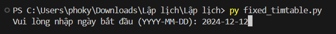
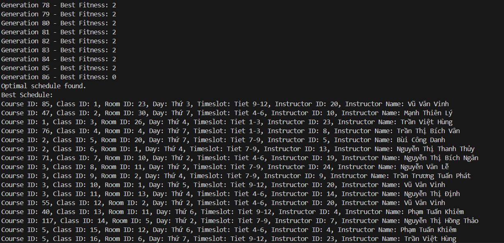
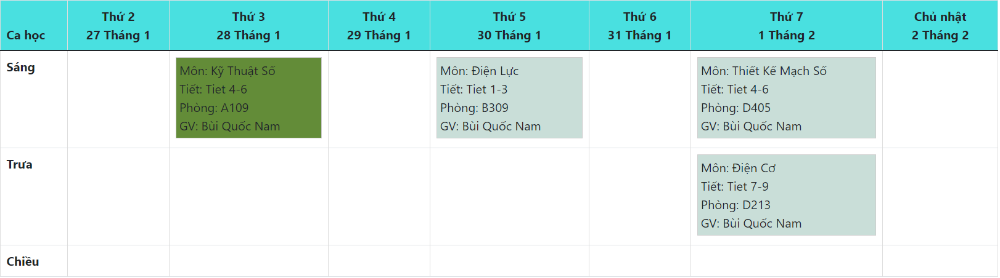

# Tối Ưu Hóa Lịch Giảng Dạy Với Thuật Toán Flamingo Search

Dự án này nhằm tối ưu hóa lịch giảng dạy cho trường học hoặc đại học bằng cách sử dụng **Flamingo Search Algorithm** (FSA). Chương trình tạo ra một lịch giảng ban đầu dựa trên các lớp học, giảng viên, phòng học và thời gian có sẵn, sau đó cải thiện lịch giảng này thông qua tối ưu hóa để giảm thiểu các xung đột (như xung đột về phòng học hoặc giảng viên).

## Mục Lục
1. [Cách Hoạt Động](#cách-hoạt-động)
2. [Hướng Dẫn Sử Dụng](#hướng-dẫn-sử-dụng)
3. [Yêu Cầu Hệ Thống](#yêu-cầu-hệ-thống)
4. [Hình Ảnh](#hình-ảnh)


## Cách Hoạt Động

### Các Thành Phần Chính
1. **Lớp `Data`** - Quản lý và tải dữ liệu từ các file CSV (lớp học, giảng viên, phòng học, thời gian học).
2. **Lớp `Solution`** - Đại diện cho một phương án thời khóa biểu và đánh giá độ "fitness" của lịch học.
3. **Hàm `Crossover`** - Kết hợp hai phương án để tạo ra một phương án mới.
4. **Hàm `Mutation`** - Đột biến một phương án để cải thiện kết quả.
5. **Thuật toán Tìm kiếm Flamingo (FSA)** - Thuật toán tối ưu hóa metaheuristic tìm kiếm lịch học tối ưu.
6. **Thêm Ngày vào Thời Khóa Biểu** - Thêm thông tin về ngày bắt đầu và kết thúc cho từng lớp học.
7. **Ghi Thời Khóa Biểu vào File CSV** - Ghi kết quả vào file CSV.

## Các Bước Thực Thi

### 1. **Khởi Tạo Lớp `Data`**
   - Lớp `Data` chịu trách nhiệm tải và quản lý dữ liệu cần thiết từ các file CSV. Cụ thể, lớp này sẽ lấy thông tin về lớp học, giảng viên, phòng học, và các thời gian học từ các file CSV đã được cung cấp. Các dữ liệu này sẽ được lưu trữ vào các từ điển và danh sách.
   - Sau khi khởi tạo đối tượng `Data`, các phương thức sẽ được gọi để tải thông tin từ các file CSV vào bộ nhớ. Các dữ liệu này bao gồm:
     - **Danh sách lớp học**: Mỗi lớp học có thể có các thuộc tính như tên lớp, giảng viên, số sinh viên.
     - **Danh sách giảng viên**: Mỗi giảng viên có thông tin về các lớp mà họ giảng dạy, khả năng làm việc vào các khung giờ cụ thể.
     - **Phòng học**: Phòng học và khả năng chứa tối đa bao nhiêu sinh viên.
     - **Thời gian học**: Các khung giờ và ngày có thể sử dụng để xếp lịch cho các lớp học.
   - Những dữ liệu này sẽ được sử dụng trong các bước tiếp theo để phân phối các lớp học vào các phòng và thời gian học thích hợp.

### 2. **Khởi Tạo Lớp `Solution`**
   - Khi lớp `Solution` được khởi tạo, nó sẽ đại diện cho một phương án lịch học cụ thể. Cơ bản, nó là một lịch học đã được phân bổ ngẫu nhiên, nơi các lớp học, giảng viên, phòng học, và thời gian học đã được gán cho nhau.   
     - **Tạo lịch học ngẫu nhiên**: Lịch học sẽ được tạo ra một cách ngẫu nhiên, nơi mỗi lớp học sẽ được phân bổ một phòng học, một giảng viên và một thời gian học cụ thể. Quá trình này đảm bảo rằng các lớp học không xung đột về phòng học, giảng viên và thời gian.
     - **Tính toán độ "fitness"**: Sau khi lịch học được tạo ra, hệ thống sẽ tính toán độ "fitness" của lịch học này. Độ "fitness" là chỉ số đo lường mức độ tối ưu của lịch học, tính theo các yếu tố như:
       - **Xung đột về phòng học**: Hai lớp học không thể diễn ra cùng một lúc trong một phòng học.
       - **Xung đột về giảng viên**: Giảng viên không thể dạy hai lớp học vào cùng một thời gian.
       - **Tải trọng phòng học**: Phòng học không thể có số sinh viên vượt quá sức chứa.
     - Độ "fitness" sẽ được tính toán và đánh giá giúp chương trình xác định được lịch học nào cần cải thiện.

### 3. **Crossover (Giao Phối)**
   - Crossover là quá trình kết hợp hai lịch học từ hai phương án khác nhau để tạo ra một lịch học mới. Mục tiêu của crossover là kết hợp các yếu tố tốt từ cả hai lịch học để tạo ra một lịch học tốt hơn.
     - **Chọn điểm cắt**: Chọn một điểm cắt ngẫu nhiên trong lịch học của hai phương án. Điểm cắt này sẽ xác định phần nào của lịch học sẽ được lấy từ mỗi phương án.
     - **Kết hợp các phần**: Sau khi chọn điểm cắt, các phần từ hai lịch học sẽ được kết hợp lại. Một phần lịch học từ phương án đầu tiên sẽ được ghép nối với phần từ phương án thứ hai để tạo thành một lịch học mới.
     - **Đảm bảo tính hợp lệ**: Sau khi crossover, lịch học mới sẽ được kiểm tra xem có các xung đột về phòng học, giảng viên, hay thời gian hay không. Nếu có, chúng sẽ được xử lý để tạo ra một lịch học hợp lệ.

### 4. **Mutation (Đột Biến)**
   - Mutation giúp tạo ra sự thay đổi ngẫu nhiên trong lịch học để tránh bị rơi vào "local optimum" (tối ưu cục bộ). Quá trình này sẽ thay đổi một số yếu tố trong lịch học, chẳng hạn như thời gian học, phòng học, hoặc giảng viên.   
     - **Chọn ngẫu nhiên một lớp học**: Lớp học sẽ được chọn ngẫu nhiên để thực hiện đột biến.
     - **Thực hiện thay đổi**: Sau khi chọn lớp học, các yếu tố như giảng viên, phòng học hoặc thời gian học của lớp đó sẽ được thay đổi ngẫu nhiên. Ví dụ, có thể thay đổi thời gian học của lớp học hoặc chuyển lớp học sang một phòng học khác.
     - **Kiểm tra hợp lệ**: Sau khi thực hiện thay đổi, hệ thống sẽ kiểm tra lại lịch học xem có xung đột hay không. Nếu có, sẽ thực hiện một đột biến khác để đảm bảo tính hợp lệ.

### 5. **Thuật Toán Tìm Kiếm Flamingo (FSA)**
   - Thuật toán Tìm kiếm Flamingo (FSA) là một thuật toán tối ưu hóa metaheuristic được sử dụng để tìm ra lịch học tối ưu.
   - Thuật toán này bắt đầu với một dân số các lịch học ngẫu nhiên. Sau đó, các lịch học này sẽ được đánh giá về độ "fitness".   
     - **Khởi tạo dân số**: Ban đầu, dân số các lịch học sẽ được tạo ngẫu nhiên. Mỗi lịch học này sẽ có độ "fitness" ban đầu được tính toán.
     - **Lặp lại các thế hệ**: Thuật toán sẽ tạo ra các thế hệ tiếp theo thông qua việc áp dụng các phương pháp crossover và mutation. Sau mỗi thế hệ, các lịch học sẽ được đánh giá lại và chọn ra những phương án có độ "fitness" cao để tạo ra thế hệ tiếp theo.
     - **Tiến hóa**: Các lịch học trong dân số sẽ liên tục thay đổi qua các thế hệ, ngày càng tối ưu hơn cho đến khi đạt được một lịch học không còn thay đổi đáng kể về độ "fitness".

### 6. **Thêm Ngày vào Thời Khóa Biểu**
   - Sau khi thuật toán đã tạo ra lịch học tối ưu, bước tiếp theo là thêm thông tin về ngày bắt đầu và kết thúc cho từng lớp học.
   - Lịch học lý thuyết (LT) sẽ kéo dài trong 15 tuần, trong khi lịch học thực hành (TH) sẽ kéo dài trong 10 tuần. Thông tin ngày bắt đầu và kết thúc sẽ được tính toán tự động và gán cho từng lớp học dựa trên các yếu tố như thời gian học và thời gian giảng dạy.

### 7. **Ghi Lịch Học vào File CSV**
   - Khi quá trình tối ưu đã hoàn tất, kết quả sẽ được ghi vào một file CSV. File này sẽ bao gồm thông tin chi tiết về lịch học như:
     - **Tên lớp học**
     - **Giảng viên**
     - **Phòng học**
     - **Ngày và thời gian học**
     - **Ngày bắt đầu và kết thúc** của từng lớp học.
   - Dữ liệu trong file CSV sẽ giúp các bộ phận liên quan có thể tra cứu, điều chỉnh hoặc in ấn lịch học khi cần thiết.


## Hướng Dẫn Sử Dụng

### Bước 1: Chuẩn Bị Các Tệp Dữ Liệu Đầu Vào

Bạn cần có bốn tệp CSV sau đây:

1. **classes.csv**: Chứa thông tin về các lớp học.
   - Cột: `class_id`, `course_id`, `class_name`
   
2. **instructors.csv**: Chứa thông tin về các giảng viên.
   - Cột: `instructor_id`, `fullname`, `email`
   
3. **rooms.csv**: Chứa thông tin về các phòng học.
   - Cột: `room_id`, `name`, `type` (LT hoặc TH), `capacity`
   
4. **timeslots.csv**: Chứa thông tin về các khung giờ.
   - Cột: `TietTrongKhungGio`, `start_time`, `end_time`

### Bước 2: Chạy Chương Trình

1. Clone repository này hoặc tải mã nguồn về máy tính của bạn.
2. Đặt các tệp dữ liệu đầu vào vào cùng thư mục với mã nguồn.
3. Mở terminal hoặc command prompt và di chuyển đến thư mục chứa mã nguồn.
4. Chạy chương trình:
   ```bash
   python fixed_timtable.py
5. Sau khi chương trình chạy, bạn sẽ được yêu cầu nhập ngày bắt đầu của học kỳ theo định dạng YYYY-MM-DD. Ví dụ:
   ```bash
   Vui lòng nhập ngày bắt đầu (YYYY-MM-DD): 2024-01-01


### Bước 3: Kiểm Tra Kết Quả
Sau khi chương trình chạy xong, lịch học tối ưu sẽ được lưu vào một tệp CSV có tên `schedule.csv`.


### Bước 4: Tùy Chỉnh Hoặc Thay Đổi Tham Số
Bạn có thể điều chỉnh các tham số của Flamingo Search Algorithm (ví dụ: kích thước quần thể, tỷ lệ đột biến, số thế hệ) để tinh chỉnh quá trình tối ưu hóa.

## Yêu Cầu Hệ Thống

Chương trình yêu cầu Python 3.x trở lên và các thư viện sau:

1. pandas
2. random
3. csv
4. math
5. datetime

Để cài đặt các thư viện yêu cầu, bạn chỉ cần sử dụng file `requirements.txt`. Chạy lệnh sau trong terminal hoặc command prompt:

   ```bash
   pip install -r requirements.txt
```
## Hình Ảnh


### 1.**Nhập Ngày Bắt Đầu**



### 2.**Kết Quả Lập Lịch và Lịch Được Lập**


### 3.**Lịch Được Hiển Thị**

